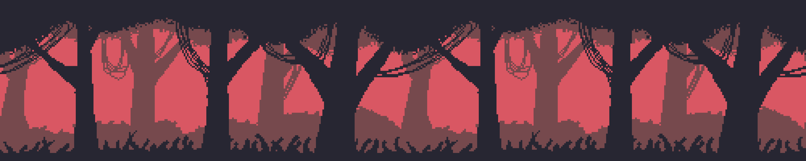

## 👋 Welcome!

### My name is Douglas, nice to meet you!
- I'm a Back-end Dev student.
- I'm from Brazil.
- I'm not good at it, but i like making new friends!
- I love learning new things!

  
💻 Technologies

  
  ### Languages
  
  
  
  
  
  ### Front-end
  
  
  
  
  ### Back-end
  
  
  
  ### Databases
  
  

  ### Interests
  
  
  
  
  
  
  
  
  

  
🗒️ More about me

  ### Things I like to do
  - Sometimes I draw stuff (Not good stuff tho)
  - I like playing games on my breaks, like Space Station 13, Hollow Knight and Terraria.
  - Watch movies with friends.
  - Chat about technologies and Gen-Z humor, lol!

  I look forwards to work on a team project soon, I think it would be a good chance to gain experience and build relationships.

  If you want to chat, add me on discord!
  Sonlye#5049

  (English / Native Brazilian-Portuguese)

 

  
  
  

